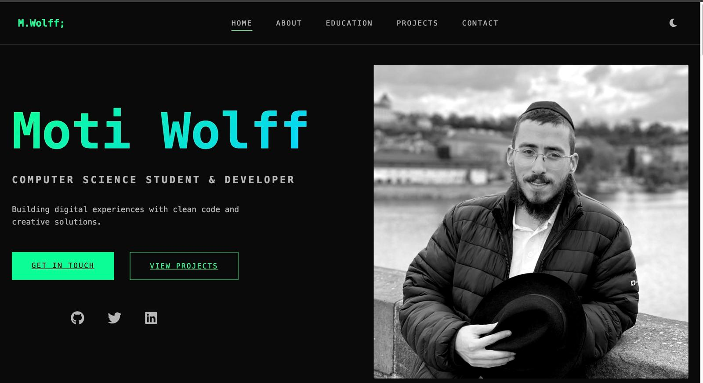

# Moti Wolff - Portfolio Website

A modern, responsive portfolio website showcasing my software development projects and professional experience. Built with clean, semantic HTML5, CSS3, and vanilla JavaScript.



## 🌟 Features

- **Responsive Design**: Fully responsive layout that works seamlessly on desktop, tablet, and mobile devices
- **Modern UI**: Clean and professional interface using Bootstrap 5
- **Animations**: Smooth scroll animations using AOS (Animate On Scroll) library
- **SEO Optimized**: Implemented best practices for search engine optimization
- **Performance Focused**: Optimized images and minimal JavaScript usage
- **Accessibility**: ARIA labels and semantic HTML structure

## 🛠️ Technologies Used

- HTML5
- CSS3
- JavaScript
- Bootstrap 5.3.2
- Bootstrap Icons
- AOS (Animate On Scroll)

## 📂 Project Structure

```
├── index.html              # Main HTML file
├── styles.css             # Custom CSS styles
├── images/               # Image assets
│   └── webs/            # Project screenshots and images
├── robots.txt           # Search engine crawling rules
├── sitemap.xml         # Site structure for search engines
└── README.md           # Project documentation
```

## 🚀 Getting Started

1. Clone the repository:
   ```bash
   git clone https://github.com/MotiWolff/Capstone-Resume.git
   ```

2. Open `index.html` in your browser to view the website locally

3. To make changes:
   - Edit `index.html` for content changes
   - Modify `styles.css` for styling adjustments
   - Add images to the `images/webs/` directory

## 📱 Features by Section

### Navigation
- Responsive navbar with mobile dropdown menu
- Smooth scrolling to sections
- Active section highlighting

### Hero Section
- Professional introduction
- Call-to-action buttons
- Profile image

### Resume Section
- Key skills and experiences
- Downloadable resume
- Professional highlights

### Projects Section
- Featured project showcase
- Project descriptions
- Live demo and GitHub repository links

### About Section
- Professional background
- Technical skills
- Personal achievements

### Contact Section
- Direct contact information
- Social media links
- Professional networks

## 🔧 Customization

1. **Colors**: Update Bootstrap classes or override in `styles.css`
2. **Content**: Modify text in `index.html`
3. **Images**: Replace images in `images/webs/` directory
4. **Projects**: Add or remove project cards in the projects section

## 📈 SEO Implementation

- Meta tags for search engines
- Open Graph tags for social media
- Twitter Card support
- Semantic HTML structure
- Sitemap and robots.txt
- Optimized content structure

## 🤝 Contributing

Feel free to fork this repository and customize it for your own use. If you find any bugs or have suggestions for improvements, please open an issue or submit a pull request.

## 📄 License

This project is open source and available under the [MIT License](LICENSE).

## 📞 Contact

- Website: [motiwolff.com](https://motiwolff.com)
- LinkedIn: [Mordechay Wolff](https://www.linkedin.com/in/mordechay-wolff-13b440180/)
- GitHub: [@MotiWolff](https://github.com/MotiWolff)
- Email: motiwolff@gmail.com

---

⭐️ If you found this helpful, please star the repository! 